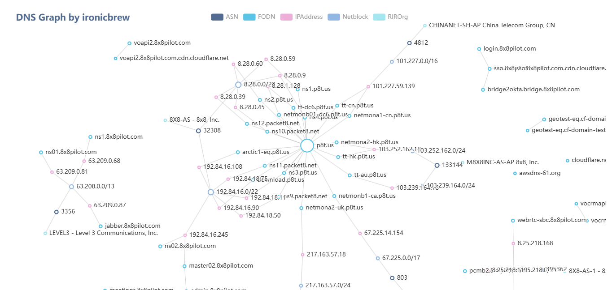

# Amass SQLite Visualizer

This project is a web-based tool for visualizing data from `amass.sqlite` files. It uses the **go-echarts** library to create interactive graph visualizations of assets and their relationships stored in a SQLite database.

## Features

- **Interactive Graph Visualization**: Displays assets as nodes and relationships as links.
- **Node Categories**: Categorizes nodes based on their types.
- **Customizable Labels**: Optionally display relationship types on the links.
- **Responsive Web Server**: Runs a local web server to render the visualization in your browser.

## Installation

### Prerequisites

0. **Amass (OWASP)**: Run an enumeration on a target domain using **[AMASS](https://github.com/owasp-amass/amass)**
1. **Go (Golang)**: Install from [Go's official site](https://go.dev/).
2. **SQLite**: Ensure you have SQLite installed on your machine.
3. **Go Modules**: Ensure `go mod` is enabled for dependency management.

### Setup

0. Clone this repository:

   ```bash
   git clone https://github.com/ironicbrew/amass-viz.git
   cd amass-viz

   ```

1. Install dependencies:

   ```bash
   go mod tidy
   ```

2. Run the Server

   ```bash
   go run main.go --dbPath ./path/to/amass.sqlite
   ```

3. Open your browser and navigate to ```http://localhost:8081```



## Flags

| Flag       | Description                                 | Default          |
| ---------- | ------------------------------------------- | ---------------- |
| `--dbPath` | Path to the SQLite database file.           | `./amass.sqlite` |
| `--labels` | Show relationship type labels on the links. | `false`          |

## Dependencies

- **[amass](https://github.com/owasp-amass/amass)**: Network mapping of attack surfaces
- **[go-echarts](https://github.com/go-echarts/go-echarts)**: Library for creating beautiful charts in Go.
- **[mattn/go-sqlite3](https://github.com/mattn/go-sqlite3)**: SQLite driver for Go.

## Development

### Code Structure

- **Graph Nodes**: Generated based on assets in the database.
- **Graph Links**: Represent relationships between nodes.
- **Graph Categories**: Categorize nodes by asset type.
- **Web Server**: Renders the visualization on a local web server.

### Debugging

Use the `prettyPrint` function to debug output:

```go
prettyPrint(variable)
```

## License

This project is licensed under the [MIT License](LICENSE).

## Author

Developed by [ironicbrew](https://github.com/ironicbrew).